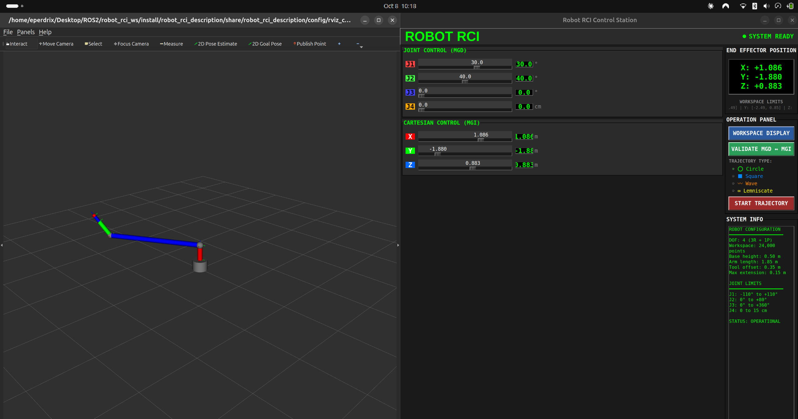
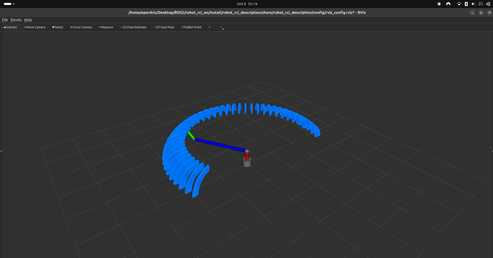
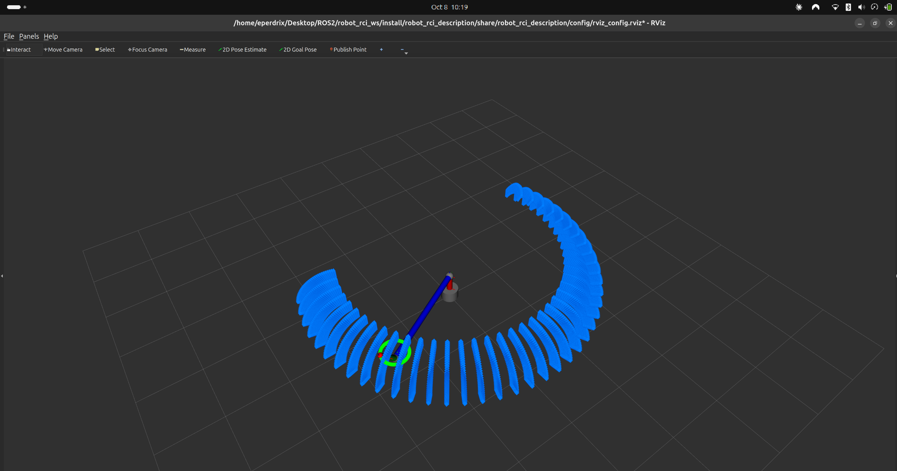
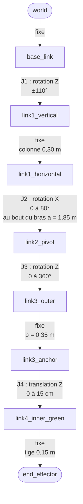
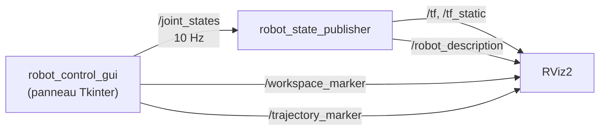
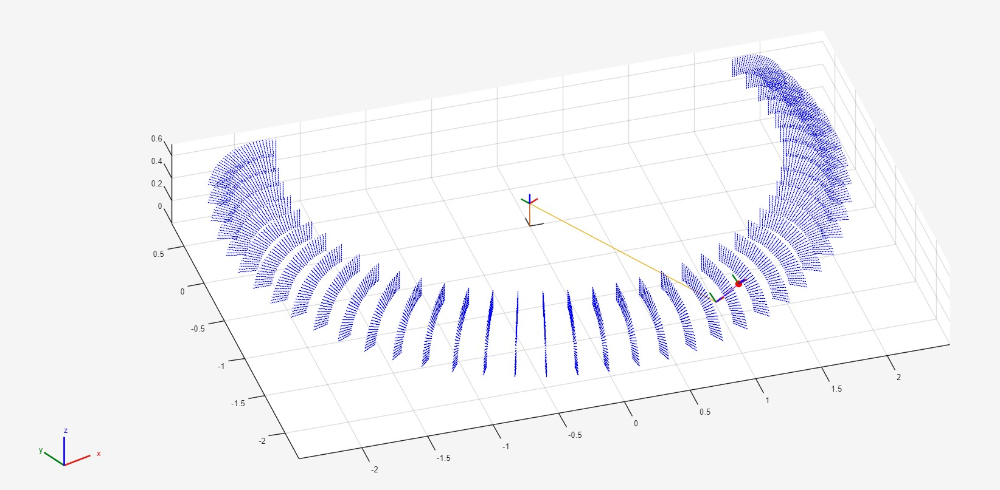

# Robot RCI — Simulateur d'un bras manipulateur 4 DDL sous ROS 2

[](https://docs.ros.org/en/lyrical/)
[](https://ubuntu.com/)
[](https://www.python.org/)
[](src/robot_rci_gui/test/test_kinematics.py)
[](LICENSE)

Station de contrôle pour un bras manipulateur porte-outil à 4 degrés de liberté (3 rotations + 1 translation) : pilotage articulaire par le modèle géométrique direct (MGD), pilotage cartésien par le modèle géométrique inverse (MGI), affichage de l'espace de travail, suivi de quatre trajectoires et validation croisée des deux modèles, le tout visualisé en 3D dans RViz.

Le projet est né d'un projet de robotique de 4e année (SE4) à Polytech Lille, d'abord réalisé sous MATLAB, puis entièrement repris sous ROS 2.



## Sommaire

- [Fonctionnalités](#fonctionnalités)
- [Le robot](#le-robot)
- [Modèles géométriques](#modèles-géométriques)
- [Résultats vérifiés](#résultats-vérifiés)
- [Installation](#installation)
- [Utilisation](#utilisation)
- [Architecture ROS 2](#architecture-ros-2)
- [Version MATLAB d'origine](#version-matlab-dorigine)
- [Structure du dépôt](#structure-du-dépôt)
- [Dépannage](#dépannage)
- [Limites connues et pistes](#limites-connues-et-pistes)
- [Auteur et crédits](#auteur-et-crédits)

## Fonctionnalités

| Fonction | Ce qu'elle fait |
|---|---|
| **Contrôle articulaire (MGD)** | Quatre curseurs J1 à J4. La position cartésienne de l'effecteur est recalculée en direct. |
| **Contrôle cartésien (MGI)** | Trois curseurs X, Y, Z. Les angles articulaires sont recalculés, avec saturation aux butées. |
| **Espace de travail** | Nuage de 24 000 points atteignables (grille 40 × 30 × 20 sur q1, q2, q4), affiché dans RViz. |
| **Trajectoires** | Cercle, carré, vague sinusoïdale et lemniscate, tracées dans RViz et suivies en boucle par l'effecteur. |
| **Validation MGD ↔ MGI** | Enchaîne MGD → MGI → MGD sur une configuration test et affiche l'erreur de position. |
| **Interface** | Panneau Tkinter sombre de type pupitre industriel, avec afficheurs numériques. |

| Espace de travail | Trajectoire en cours |
|---|---|
|  |  |

## Le robot

Bras porte-outil de type **RRRP** : une rotation verticale à la base, une épaule qui bascule autour d'un axe horizontal au bout d'un long bras, une rotation de l'outil sur lui-même et un axe télescopique.



*Chaîne cinématique de l'URDF. Les liens purement visuels (sphère de J1, tube bleu du télescope) sont omis.*

| Paramètre | Valeur | Rôle |
|---|---|---|
| `a` | 1,85 m | Longueur du bras horizontal, entre l'axe de J1 et l'épaule J2 |
| `b` | 0,35 m | Longueur du tube porte-outil au-dessus de J3 |
| Hauteur de l'épaule | 0,50 m | Socle de 0,20 m + colonne de 0,30 m |
| Partie télescopique | 0,15 m + q4 | Longueur fixe de la tige + course de J4 |

| Articulation | Type | Axe | Butées |
|---|---|---|---|
| J1 | Rotation | Z | −110° à +110° |
| J2 | Rotation | X | 0° à +80° |
| J3 | Rotation | Z (axe de l'outil) | 0° à 360° |
| J4 | Translation | Z (axe de l'outil) | 0 à 15 cm |

J3 fait tourner l'outil autour de son propre axe : elle change son orientation, pas la position de l'effecteur. C'est pourquoi le MGI la fixe à 0.

## Modèles géométriques

Notons $L = b + q_4 + 0{,}15$ la distance entre l'épaule et l'effecteur.

**Modèle géométrique direct (MGD)**

```math
\begin{aligned}
X &= \bigl(a + L\sin q_2\bigr)\sin q_1 \\
Y &= -\bigl(a + L\sin q_2\bigr)\cos q_1 \\
Z &= L\cos q_2 + 0{,}5
\end{aligned}
```

**Modèle géométrique inverse (MGI)**, avec $r = \sqrt{X^2 + Y^2}$ :

```math
\begin{aligned}
q_1 &= \operatorname{atan2}(X,\,-Y) \\
q_2 &= \operatorname{atan2}(r - a,\; Z - 0{,}5) \\
q_3 &= 0 \\
q_4 &= \sqrt{(r - a)^2 + (Z - 0{,}5)^2} \;-\; b - 0{,}15
\end{aligned}
```

Les valeurs obtenues sont ensuite saturées aux butées articulaires. Pour qu'une position soit atteignable sans saturation à la hauteur des trajectoires (Z = 1,0 m), il faut $a \le r \le a + 0{,}415$ m : la limite basse vient de $q_2 \ge 0$, la limite haute de $q_4 \le 15$ cm. La fonction `is_reachable()` du panneau fait ce test et signale dans le terminal toute trajectoire qui sortirait de cette zone.

## Résultats vérifiés

Ces chiffres viennent des tests de [`src/robot_rci_gui/test/test_kinematics.py`](src/robot_rci_gui/test/test_kinematics.py), qui appellent directement les méthodes du panneau de contrôle (voir [Lancer les tests](#lancer-les-tests)).

| Vérification | Résultat |
|---|---|
| Bouton de validation, q = (30°, 40°, 0, 12 cm) | erreur de position ≈ 2,5 × 10⁻¹⁶ m |
| Aller-retour MGD → MGI → MGD sur les 24 000 configurations | erreur maximale ≈ 5,7 × 10⁻¹⁶ m |
| Bornes de l'espace de travail | X ∈ [−2,49 ; 2,49] m, Y ∈ [−2,49 ; 0,85] m, Z ∈ [0,59 ; 1,15] m |
| Trajectoires | les 260 points des 4 trajectoires sont atteignables, et l'effecteur passe exactement dessus |

Les erreurs sont de l'ordre de la précision machine en double précision : sur tout l'espace articulaire testé, le MGI est l'inverse exact du MGD.

## Installation

Testé sous **Ubuntu 26.04 LTS** avec **ROS 2 Lyrical Luth**.

**1. Dépendances**

```bash
sudo apt update
sudo apt install -y \
    ros-lyrical-desktop \
    ros-lyrical-xacro \
    ros-lyrical-robot-state-publisher \
    ros-lyrical-rviz2 \
    python3-colcon-common-extensions \
    python3-tk \
    python3-numpy \
    python3-pytest
```

**2. Récupération et compilation**

```bash
mkdir -p ~/ros2_ws && cd ~/ros2_ws
git clone https://github.com/edp1806/robot_rci.git robot_rci_ws
cd robot_rci_ws
source /opt/ros/lyrical/setup.bash
colcon build
source install/setup.bash
```

**3. Vérification**

```bash
ros2 pkg list | grep robot_rci
# robot_rci_control
# robot_rci_description
# robot_rci_gui
```

## Utilisation

**Tout lancer d'un coup** (robot_state_publisher, RViz et panneau de contrôle) :

```bash
ros2 launch robot_rci_description robot_complete.launch.py
```

ou, de façon équivalente, `./scripts/start_robot_rci.sh`.

RViz s'ouvre avec sa configuration : repère fixe `world`, modèle du robot, repères TF, et les displays *Workspace* et *Trajectory* déjà branchés sur `/workspace_marker` et `/trajectory_marker`. Il n'y a rien à ajouter à la main.

**Dans le panneau de contrôle**

| Action | Effet |
|---|---|
| Curseurs J1 à J4 | Pilotage articulaire. X, Y et Z se mettent à jour. |
| Curseurs X, Y, Z | Pilotage cartésien. Les angles se mettent à jour. |
| `WORKSPACE DISPLAY` | Calcule et affiche le nuage de points (quelques secondes). Un second clic le masque. |
| Choix de trajectoire puis `START TRAJECTORY` | Trace la courbe et la fait suivre en boucle. `STOP TRAJECTORY` arrête et efface. |
| `VALIDATE MGD ↔ MGI` | Affiche l'erreur de l'aller-retour sur la configuration test. |

**Trajectoires disponibles**, toutes horizontales à Z = 1,0 m et centrées sur (−1,727 ; −1,118) m :

| Trajectoire | Paramètres | Points | Couleur |
|---|---|---|---|
| Cercle | rayon 0,20 m | 60 | vert |
| Carré | côté 0,28 m | 4 × 15 | bleu |
| Vague | amplitude 0,15 m sur 0,40 m, 2 périodes | 60 | orange |
| Lemniscate | échelle 0,15 m | 80 | jaune |

L'effecteur avance d'un point toutes les 50 ms. Le panneau publie les positions articulaires sur `/joint_states` à 10 Hz, et republie la courbe toutes les secondes tant que la trajectoire tourne.

**Autres lancements**

| Commande | Usage |
|---|---|
| `ros2 launch robot_rci_description display.launch.py` | RViz et le modèle seuls, sans panneau |
| `ros2 launch robot_rci_description foxglove.launch.py` | Visualisation dans [Foxglove](https://foxglove.dev) au lieu de RViz (`sudo apt install ros-lyrical-foxglove-bridge`, puis connexion à `ws://localhost:8765`) |
| `./scripts/start_rviz_vnc.sh` | RViz dans un serveur X virtuel affiché par VNC, en dernier recours si l'affichage clignote encore (voir [Dépannage](#dépannage)) |

### Lancer les tests

```bash
source install/setup.bash
python3 -m pytest src/robot_rci_gui/test -v
```

## Architecture ROS 2



| Package | Rôle |
|---|---|
| `robot_rci_description` | URDF/xacro du robot, configuration RViz, fichiers de lancement |
| `robot_rci_gui` | Panneau de contrôle : MGD, MGI, espace de travail, trajectoires, validation, tests |
| `robot_rci_control` | Nœuds séparés (MGD, MGI, trajectoire, validation, espace de travail), voir [Limites connues](#limites-connues-et-pistes) |

## Version MATLAB d'origine

Le dossier [`matlab/`](matlab/) contient la première version du projet, réalisée en binôme avec **Badria El-Ghoche** dans le cadre du projet RCI de SE4 (octobre 2025) :

- [`Projet_RCI.m`](matlab/Projet_RCI.m) : simulateur MATLAB avec modèle `rigidBodyTree`, curseurs articulaires et cartésiens, validation croisée, suivi d'un cercle et tracé des signaux articulaires. Il nécessite la *Robotics System Toolbox*.
- [`Rapport Projet_RCI.pdf`](matlab/Rapport%20Projet_RCI.pdf) : rapport du projet (modélisation, MGD, MGI, validation, trajectoire).

La version ROS 2 reprend les mêmes paramètres `a` et `b` et la même grille d'espace de travail, et y ajoute un modèle 3D plus détaillé (colonne de 0,30 m et tige télescopique de 0,15 m), trois trajectoires supplémentaires et l'interface Tkinter.



## Structure du dépôt

```text
robot_rci_ws/
├── src/
│   ├── robot_rci_description/       # Modèle et visualisation
│   │   ├── urdf/robot_rci.urdf.xacro
│   │   ├── config/rviz_config.rviz
│   │   └── launch/
│   │       ├── display.launch.py         # robot_state_publisher + RViz
│   │       ├── robot_complete.launch.py  # display + panneau de contrôle
│   │       ├── foxglove.launch.py        # alternative à RViz
│   │       └── gazebo.launch.py          # non fonctionnel sous Lyrical
│   ├── robot_rci_gui/               # Panneau de contrôle
│   │   ├── robot_rci_gui/control_panel.py
│   │   └── test/test_kinematics.py
│   └── robot_rci_control/           # Nœuds séparés (non vérifiés sous Lyrical)
├── matlab/                          # Version MATLAB d'origine
├── scripts/                         # Scripts de lancement
├── docs/images/                     # Captures du README
├── LICENSE
└── README.md
```

## Dépannage

**La vue 3D de RViz clignote (une image sur deux est noire).**
Ce problème se produit sous GNOME Wayland avec une mise à l'échelle fractionnaire de l'écran : RViz2 passe par XWayland, et le scaling HiDPI de Qt fait clignoter sa fenêtre de rendu, même en rendu logiciel. `display.launch.py` lance donc RViz avec `QT_QPA_PLATFORM=xcb` et le scaling Qt désactivé. C'est actif par défaut. Pour le désactiver, par exemple dans une session X11 sur un écran HiDPI où RViz paraîtrait trop petit :

```bash
ros2 launch robot_rci_description robot_complete.launch.py qt_scaling_fix:=false
```

Si l'affichage clignote encore, `./scripts/start_rviz_vnc.sh` lance RViz dans un serveur X indépendant (Xvnc, accessible uniquement en local) et l'affiche dans une fenêtre VNC. Il faut d'abord installer `tigervnc-standalone-server` et `tigervnc-viewer`.

**`Package 'robot_rci_description' not found`.**
Le workspace n'est pas sourcé dans ce terminal : `source install/setup.bash`.

**Le robot n'apparaît pas dans RViz (`RobotModel: Status Error`).**
Vérifie que `robot_state_publisher` tourne (`ros2 node list`). La configuration fournie lit `/robot_description` en *Transient Local*, ce qui permet de recevoir le modèle même si RViz démarre après le publisher.

**Le robot ne bouge pas, ou le TF est en warning.**
Rien ne publie sur `/joint_states` : lance le panneau de contrôle (`robot_complete.launch.py`), pas `display.launch.py` seul.

**`apt` renvoie `404 Not Found` sur un paquet ROS.**
La liste des paquets date d'avant une synchronisation du dépôt ROS : `sudo apt update`, puis relance l'installation.

## Limites connues et pistes

**Limites actuelles**

- `gazebo.launch.py` dépend de `gazebo_ros` (Gazebo Classic), qui n'existe plus sous ROS 2 Lyrical. Ce fichier de lancement ne fonctionne pas en l'état.
- Les nœuds du package `robot_rci_control` (`control.launch.py`, `trajectory.launch.py`) n'ont pas été vérifiés depuis le passage à Lyrical. Le panneau de contrôle n'en dépend pas.
- Le bouton de validation ne teste qu'une configuration. La validation sur tout l'espace de travail se fait avec les tests pytest.
- Le suivi de trajectoire est purement géométrique : pas de profil de vitesse, pas de dynamique.

**Pistes**

- Simulation physique avec Gazebo Sim (`ros_gz`)
- Planification avec MoveIt 2
- Jacobienne et détection des singularités
- Interpolation par splines et profils de vitesse
- Enregistrement et rejeu de trajectoires personnalisées

## Auteur et crédits

**Edouard Perdrix**, élève ingénieur en Systèmes Embarqués à Polytech Lille ([@edp1806](https://github.com/edp1806)).

- Version MATLAB : réalisée en binôme avec Badria El-Ghoche (projet RCI, SE4, Polytech Lille)
- Version ROS 2 : Edouard Perdrix
- Merci à l'équipe pédagogique du département SE de Polytech Lille, et à la communauté ROS 2

Ce projet est distribué sous licence [MIT](LICENSE).
